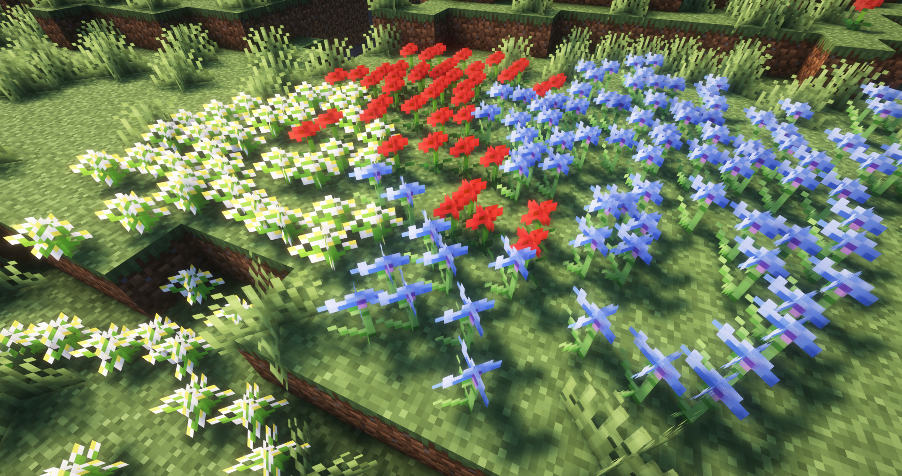

A Fabric mod that makes flower fields look denser by rendering multiple flowers per block.

Flowers that stand next to more flowers are more likely to be displayed as multiple flowers.
This mod does not need to be run server-side so that you can enjoy dense flowers everywhere.

